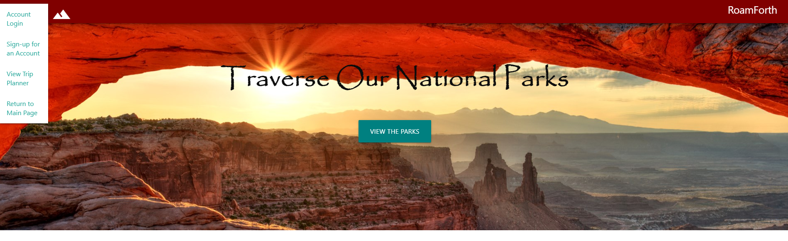
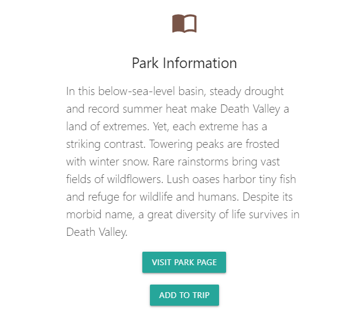
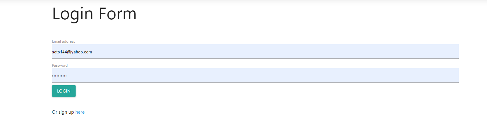
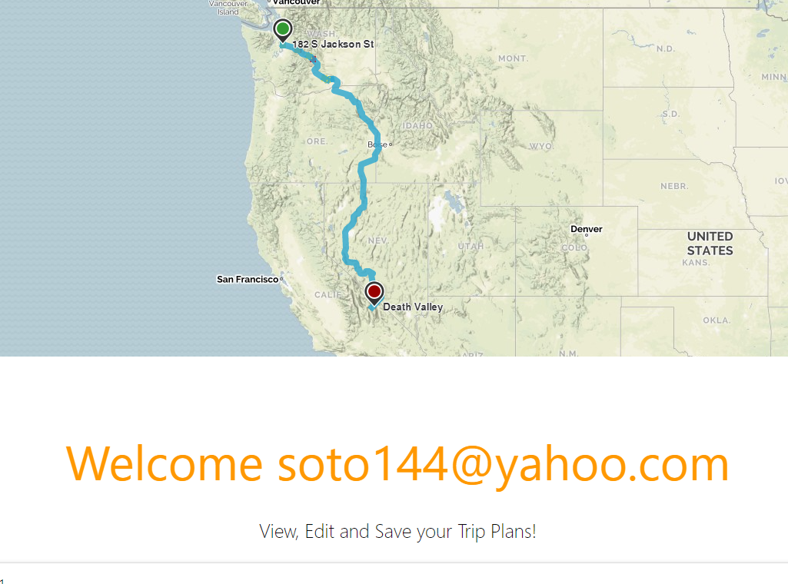

# Project2

## Description
This application is for users looking to go on an adventure in a national park.

## Functionality:
When the application loads the user is given an option to get started. Once the user clicks the get started button, a modal pops up to let the user choose which state they would like to explore. After the state selection, the user can choose a national park to load. When the national park is selected, it will display information about the park, images(when available), and activities. The user can visit the parks official page in the information section. If the user decides to visit this park, they have the option to get directions to the park towards the bottom of the page.

## New Features: 
- "Add to Trip" button - user can select a park their interested in and add it to their trip planner
- "Pop Up Alert" for when trip is added
- Account Sign in, Account Sign-up and View Trip Planner Pages
- Road trip map that displays the places saved by user
- "Log out" of account option

## Sources:
Visual Studio Code (https://code.visualstudio.com/)
Materialize CSS Framework (https://materializecss.com/)
MapQuest API (https://developer.mapquest.com/)
National Parks Service API (https://www.nps.gov/subjects/developer/api-documentation.htm)

### Installation Instructions
- Run npm i to install dependencies and create database in mySQL

### Test Instuctions
You can test api routes with postman

### Contribution Guideline
The guideline to contribute will be to have a new branch and a descriptive pull request as to the changes you made/added and why.

### License
This Application is covered under the MIT License.

## Technologies used
- Node.js
- Express.js
- MySql
- ESLint
- Handlebars
- Heroku

## License
- This Application is covered under the MIT License.

## Screenshots

